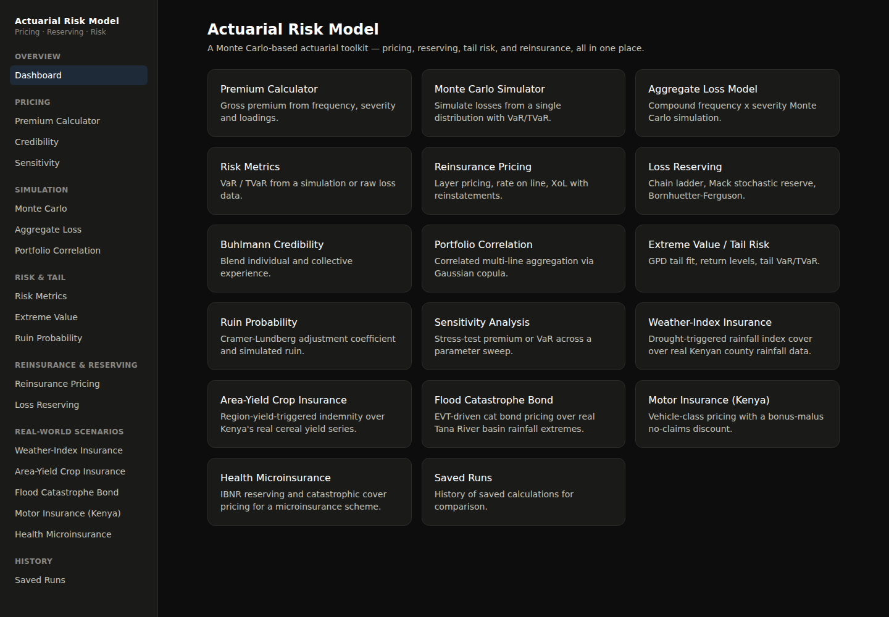
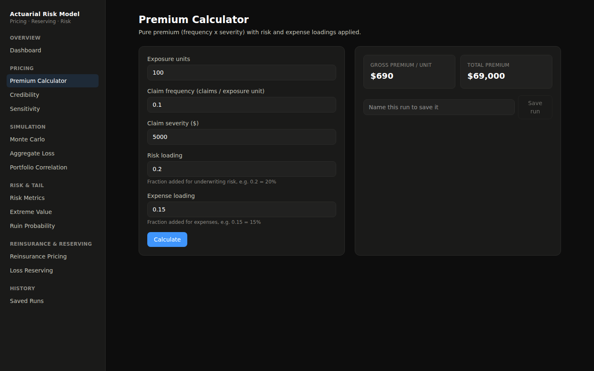
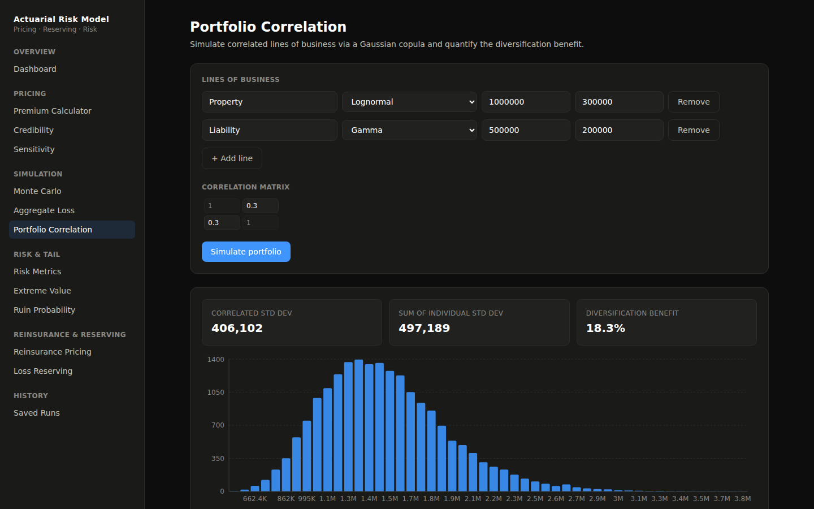
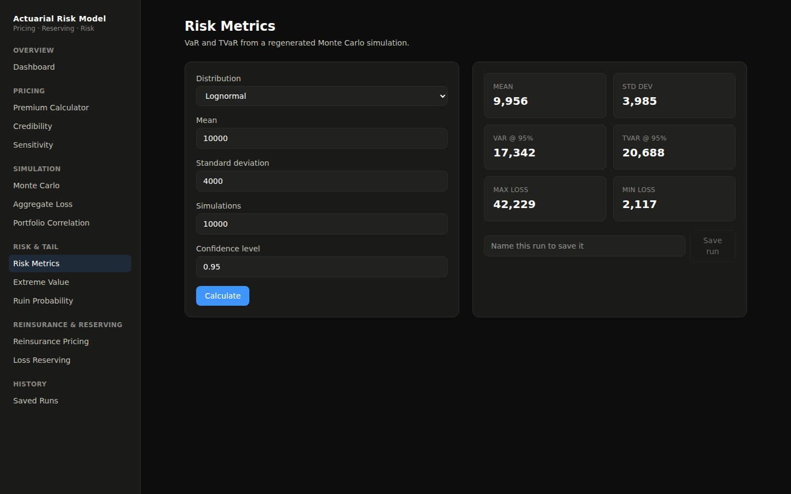
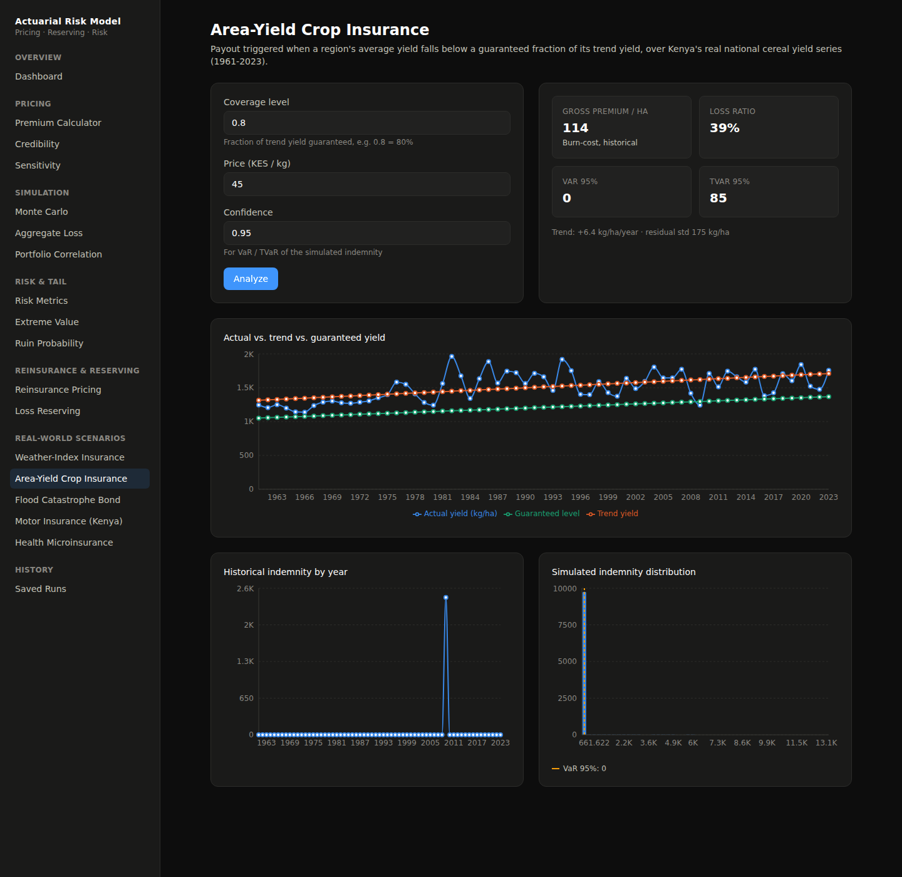
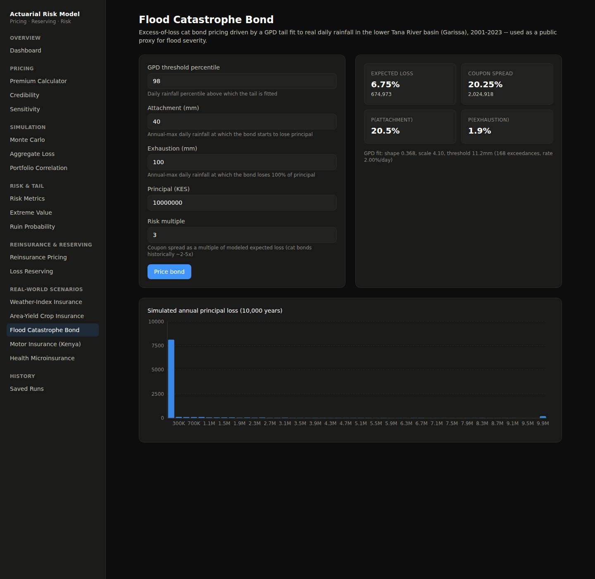
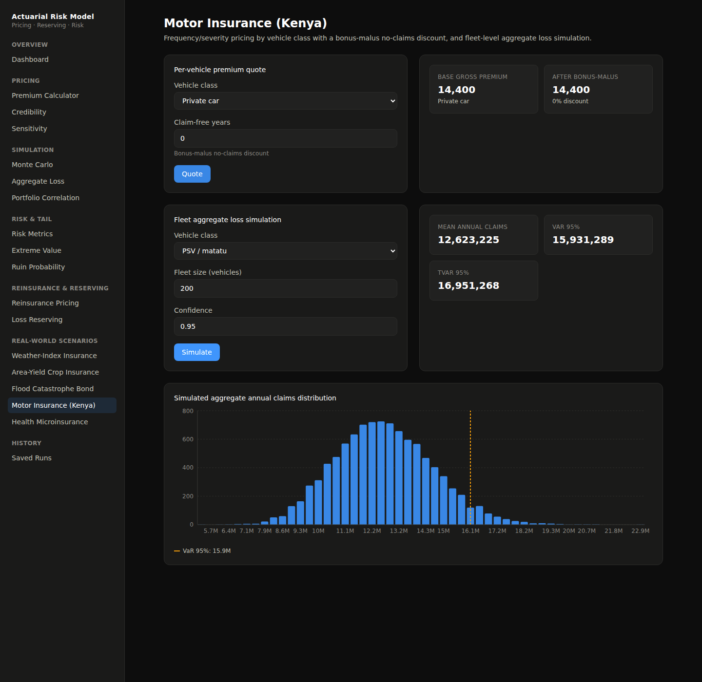
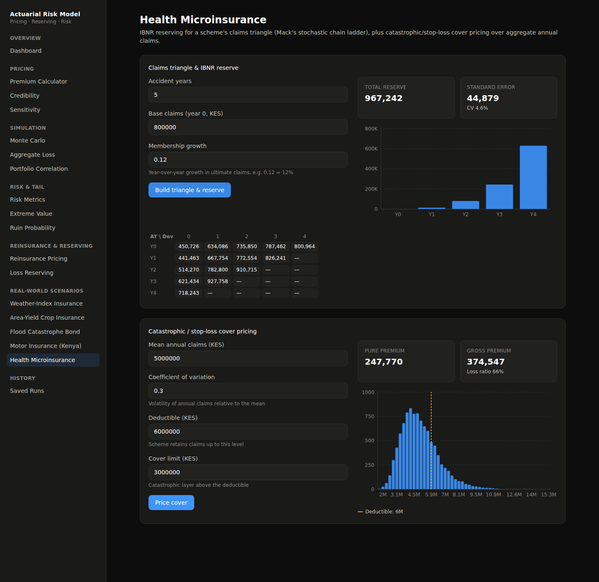

<div align="center">

# 📈 Actuarial Risk Model — Frontend

**React + TypeScript dashboard for the [Actuarial Risk Model API](https://github.com/JessyWaweru/ACTUARIAL_RISK_MODEL) — pricing, reserving, and tail-risk modeling in the browser.**

[](https://react.dev/)
[](https://www.typescriptlang.org/)
[](https://vite.dev/)
[](https://tailwindcss.com/)
[](LICENSE)

</div>

---

## 🌐 Overview

A single-page dashboard that turns the [Actuarial Risk Model API](https://github.com/JessyWaweru/ACTUARIAL_RISK_MODEL)'s Monte Carlo engine, pricing tools, and tail-risk models into interactive forms and charts — pricing a policy, running a simulation, or stress-testing an assumption is a form submit away.

## ✨ Features

- 💰 **Premium Calculator** — gross premium from frequency, severity, and loadings
- 🎲 **Monte Carlo Simulator** — single-distribution loss simulation with a live histogram and VaR/TVaR
- 📦 **Aggregate Loss Model** — compound frequency × severity simulation
- 📉 **Risk Metrics** — VaR / TVaR at 95%/99% from a simulation or raw loss data
- 🛡️ **Reinsurance Pricing** — excess-of-loss layers, rate on line, reinstatements
- 📈 **Loss Reserving** — chain ladder, Mack stochastic reserving, Bornhuetter-Ferguson
- 🧮 **Buhlmann Credibility** — blend individual and collective experience
- 🕸️ **Portfolio Correlation** — multi-line diversification via a Gaussian copula, charted
- ⚡ **Extreme Value / Tail Risk** — GPD tail fit, return levels, tail VaR/TVaR
- 🌊 **Ruin Probability** — Cramér-Lundberg adjustment coefficient and simulated ruin
- 🎚️ **Sensitivity Analysis** — stress-test premium or VaR across a parameter sweep
- 🕓 **Saved Runs** — name and revisit past calculations, backed by the API's run history

## 🌍 Real-World Scenarios

Five live demos over real public data, showing the toolkit applied to concrete products rather than abstract distributions:

- 🌧️ **Weather-Index Insurance** — pick a county (Homa Bay, West Pokot, Turkana), set a rainfall strike/exit, and watch 33 years of real seasonal rainfall turn into a payout history, a simulated payout distribution, and a burn-cost premium
- 🌾 **Area-Yield Crop Insurance** — Kenya's real national cereal yield series (1961-2023) against a fitted trend, with indemnity triggered by yield shortfall
- 🌊 **Flood Catastrophe Bond** — GPD tail fit to real daily rainfall in the Tana River basin, priced into expected loss, attachment/exhaustion probabilities, and coupon spread
- 🚗 **Motor Insurance (Kenya)** — per-vehicle-class premium quotes with a bonus-malus discount, plus fleet-level aggregate loss simulation
- 🏥 **Health Microinsurance** — a claims triangle with Mack's stochastic IBNR reserve, plus catastrophic/stop-loss cover pricing

## 📸 Screenshots

<div align="center">

**Dashboard**


**Premium Calculator**


**Monte Carlo Simulator**


**Portfolio Correlation**


**Risk Metrics**


**Weather-Index Insurance — real climate shocks turning into payouts**


**Area-Yield Crop Insurance**


**Flood Catastrophe Bond**


**Motor Insurance (Kenya)**


**Health Microinsurance**


</div>

## 🧰 Tech stack

- React 19, React Router 7, TypeScript
- Vite 8, Tailwind CSS v4
- Recharts for histograms and distribution charts
- Oxlint

## ⚙️ Setup

**Prerequisites:** Node.js 20+, and the [backend API](https://github.com/JessyWaweru/ACTUARIAL_RISK_MODEL) running locally on port 8000.

```bash
# Clone
git clone https://github.com/JessyWaweru/actuarial_risk_model_frontend.git
cd actuarial_risk_model_frontend

# Install dependencies
npm install

# Start the dev server
npm run dev
```

Open **http://localhost:5173**. The dev server proxies `/api/*` requests to `http://localhost:8000` (see `vite.config.ts`), so start the backend first:

```bash
# in the backend repo
uvicorn actuarial_risk_model.api.main:app --app-dir src --reload
```

### Other scripts

```bash
npm run build      # type-check + production build to dist/
npm run preview    # preview the production build
npm run lint        # oxlint
```

## 🗂️ Structure

```
src/
├── api/client.ts     # fetch wrapper for every backend endpoint
├── components/       # Layout, charts (Recharts), form/UI primitives, SaveRun
├── pages/             # One page per model: Premium, MonteCarlo, RiskMetrics,
│                       # Reinsurance, Reserving, Credibility, Portfolio,
│                       # ExtremeValue, Ruin, Sensitivity, RunHistory, Dashboard,
│                       # WeatherIndex, AreaYield, CatBond, Motor, HealthMicro
├── theme.ts           # Shared chart/theme tokens
└── types.ts           # Request/response types mirroring the API's Pydantic schemas
```

## 🚢 Deploying

This is a static site: `npm run build` outputs `dist/`. Deploy it to any static host (Render, Netlify, Vercel, GitHub Pages) and put a reverse proxy in front of it that forwards `/api/*` to the deployed backend — the same relationship `vite.config.ts`'s dev proxy expresses locally. Remember to add this site's origin to the backend's CORS allowlist.

## 📄 License

MIT — see [LICENSE](LICENSE).
